## Terraform AWS WordPress Capstone Project – Complete Execution Guide
**Project Overview**

This project deploys a highly available WordPress application on AWS using Terraform.

### Architecture Components

- VPC (10.0.0.0/16)
   - Public Subnets (ALB, Bastion)
   - Private App Subnets (WordPress EC2)
   - Private DB Subnets (RDS)
- Internet Gateway (IGW) → public access
- NAT Gateway → private subnet internet access
- Bastion Host → SSH jump server
- Application Load Balancer (ALB) → routes traffic to WordPress
- Auto Scaling Group (ASG) → WordPress EC2 instances
- EFS (Elastic File System) → shared WordPress storage
- RDS MySQL → database backend


### Recommended Terraform Project Structure

A modular Terraform structure keeps the project:

- Reusable
- Cleaner
- Easier to scale
- Easier to troubleshoot

 **PROJECT STRUCTURE**

 wordpress-terraform-project/

│

├── provider.tf

├── variables.tf

├── terraform.tfvars

├── outputs.tf

│

├── modules/

│   │

│   ├── vpc/

│   │   ├── main.tf

│   │   ├── variables.tf

│   │   └── outputs.tf

│   │

│   ├── nat-gateway/

│   │   ├── main.tf

│   │   ├── variables.tf

│   │   └── outputs.tf

│   │

│   ├── security-groups/

│   │   ├── main.tf

│   │   ├── variables.tf

│   │   └── outputs.tf

│   │

│   ├── bastion/

│   │   ├── main.tf

│   │   ├── variables.tf

│   │   └── outputs.tf

│   │

│   ├── alb/

│   │   ├── main.tf

│   │   ├── variables.tf

│   │   └── outputs.tf

│   │

│   ├── ec2/

│   │   ├── main.tf

│   │   ├── variables.tf

│   │   └── outputs.tf

│   │

│   └── rds/

│       ├── main.tf

│       ├── variables.tf

│       └── outputs.tf


### Phase 1 : Prerequisites
 **Install Terraform**

 verify terraform 
 ```
 terraform version
 ```

 **Install Aws CLI**
 
 Verify Installation
 
 ```
 aws --version
 ```
 **Configure AWS Configuration**
 ```
 aws configure
 ```

### Create Provider Configuration

**provider.tf**
```
provider "aws" {
  region = var.region
}
```

**Create Variables**

**variable.tf**
```
variable "region" {
  description = "The AWS region to create resources in"
  type        = string
  default     = "us-east-1"

}

variable "vpc_cidr" {
  description = "The CIDR block for the VPC"
  type        = string
  default     = "10.0.0.0/16"

}

variable "public_subnet_cidrs" {
  description = "A list of CIDR blocks for the public subnets"
  type        = list(string)
}

variable "private_subnet_cidrs" {
  description = "A list of CIDR blocks for the private subnets"
  type        = list(string)
}

variable "db_name" {
  type = string
}


variable "db_username" {
  type = string
}
variable "db_password" {
  type = string
}

variable "min_size" {
  type = number
}

variable "max_size" {
  type = number
}

variable "desired_capacity" {
  type = number
}

variable "db_instance_class" {
  type = string
}

variable "allowed_ssh_cidr" {
  description = "CIDR blocks allowed to SSH into bastion host"
  type        = list(string)
}


variable "ami_id" {
  type = string

}

variable "instance_type" {
  type = string

}

variable "wordpress_ami" {
  type = string
}

variable "ec2_key_name" {
  type = string

}


variable "key_pair_name" {
  type = string
}


variable "bastion_ami" {
  type = string
}

```

**Create terraform.tfvars**
```
region                  = "us-east-1"
vpc_cidr                = "10.0.0.0/16"
ec2_key_name            = "wordpress-key"
key_pair_name           = "wordpress-key"
public_subnet_cidrs     = ["10.0.1.0/24", "10.0.2.0/24"]
private_subnet_cidrs    = ["10.0.3.0/24", "10.0.4.0/24"]
allowed_ssh_cidr        = ["0.0.0.0/0"]
db_username             = "admin"
db_password             = "StrongPassword123!"
db_name                 = "wordpressdb"
db_instance_class       = "db.t3.micro"
desired_capacity        = 1
min_size                = 1
max_size                = 1
instance_type   = "t2.micro"
ami_id                  =  "ami-0c02fb55956c7d316"
wordpress_ami           =  "ami-0c02fb55956c7d316"
bastion_ami             = "ami-0c02fb55956c7d316"
```

**Create Vpc Module**
**module/vpc/main.tf**
```
  ##Create a VPC with the specified CIDR block and enable DNS support and hostnames. Tag the VPC with the name "Wordpress-vpc".
## create vpc
resource "aws_vpc" "main" {
    cidr_block = var.vpc_cidr
    enable_dns_hostnames = true
    enable_dns_support = true
    tags = {
        Name = "Wordpress-vpc"
    }
  
}

##INTERNET GATEWAY
resource "aws_internet_gateway" "gw" {
    vpc_id = aws_vpc.main.id
    tags = {
        Name = "Wordpress-igw"
    }
  
}


##PRIVATE SUBNET
resource "aws_subnet" "private" {
  count             = length(var.private_subnet_cidrs)
  vpc_id            = aws_vpc.main.id
  cidr_block        = var.private_subnet_cidrs[count.index]
  availability_zone = var.availability_zones[count.index]

    tags = {
        Name = "Wordpress-private-subnet"
    }
}


##PUBLIC SUBNET
resource "aws_subnet" "public" {
  count             = length(var.public_subnet_cidrs)
  vpc_id            = aws_vpc.main.id
  cidr_block        = var.public_subnet_cidrs[count.index]
  availability_zone = var.availability_zones[count.index]

    tags = {
        Name = "Wordpress-public-subnet"
    }
}

## NAT GATEWAY
resource "aws_nat_gateway" "nat" {
  allocation_id = aws_eip.nat.id
  subnet_id     = aws_subnet.public[0].id
  depends_on = [ aws_internet_gateway.gw ]

    }
## ELASTIC IP FOR NAT GATEWAY
resource "aws_eip" "nat" {
  domain = "vpc"
}

##ROUTE TABLE FOR PUBLIC SUBNET
resource "aws_route_table" "public_rt" {
  vpc_id = aws_vpc.main.id
    route {
        cidr_block = "0.0.0.0/0"
        gateway_id = aws_internet_gateway.gw.id
    }
    tags = {
        Name = "Wordpress-public-rt"
    }
}


##ROUTE TABLE ASSOCIATION FOR PUBLIC SUBNET
resource "aws_route_table_association" "public" {
   count = length(aws_subnet.public) 
  subnet_id      = aws_subnet.public[count.index].id
  route_table_id = aws_route_table.public_rt.id
}

## ROUTE TABLE FOR PRIVATE SUBNET
resource "aws_route_table" "private_rt" {
    vpc_id = aws_vpc.main.id
        route {
            cidr_block = "0.0.0.0/0"
            nat_gateway_id = aws_nat_gateway.nat.id
        }
}

## ROUTE TABLE ASSOCIATION FOR PRIVATE SUBNET
resource "aws_route_table_association" "private_association" {
    count = length(aws_subnet.private)
    subnet_id = aws_subnet.private[count.index].id
    route_table_id = aws_route_table.private_rt.id
}

```

**module/vpc/variables**
```
variable "vpc_cidr" {
    description = "The CIDR block for the VPC"
    type        = string
    
}

variable "public_subnet_cidrs" {
    description = "A list of CIDR blocks for the public subnets"
    type        = list(string)
    
}

variable "private_subnet_cidrs" {
    description = "A list of CIDR blocks for the private subnets"
    type        = list(string)
    
}

variable "availability_zones" {
    description = "A list of availability zones for the subnets"
    type        = list(string)
    
}

```

**modules/vpc/output.tf**
```
output "vpc_id" {
  value = aws_vpc.main.id
  description = "VPC ID"
}

output "public_subnet_ids" {
  value = aws_subnet.public[*].id
  description = "Public Subnet IDs"
}


output "private_subnet_ids" {
  value = aws_subnet.private[*].id
  description = "Private Subnet IDs"
}

```

**Call All Modules in Root main.tf**
**main.tf**
```
data "aws_availability_zones" "available" {}

module "vpc" {
  source = "./modules/vpc"

  vpc_cidr             = var.vpc_cidr
  public_subnet_cidrs  = var.public_subnet_cidrs
  private_subnet_cidrs = var.private_subnet_cidrs
  availability_zones   = data.aws_availability_zones.available.names
}


module "security_group" {
  source = "./modules/security-group"

  vpc_id           = module.vpc.vpc_id
  allowed_ssh_cidr = var.allowed_ssh_cidr
}

module "rds" {
  source = "./modules/rds"

  vpc_id                 = module.vpc.vpc_id
  private_subnet_ids     = module.vpc.private_subnet_ids
  db_name                = var.db_name
  db_user                = var.db_username
  db_password            = var.db_password
  allocated_storage      = 20
  db_instance_class      = var.db_instance_class
  wordpress_sg_id        = module.security_group.wordpress_sg_id
  rds_security_group_ids = [module.security_group.rds_sg_id]
}


module "efs" {
  source = "./modules/efs"

  vpc_id                = module.vpc.vpc_id
  private_subnet_ids    = module.vpc.private_subnet_ids
  efs_security_group_id = module.security_group.efs_sg_id
}

module "alb" {
  source = "./modules/alb"

  vpc_id            = module.vpc.vpc_id
  public_subnet_ids = module.vpc.public_subnet_ids

  alb_sg_id = module.security_group.alb_sg_id
}

module "bastion" {
  source                = "./modules/bastion"
  ami_id                = var.bastion_ami
  ec2_key_name          = var.ec2_key_name
  instance_type = var.instance_type
  public_subnet_id      = module.vpc.public_subnet_ids[0]
  security_group_ids    = [module.security_group.bastion_sg_id]

}

module "asg" {
  source             = "./modules/asg"
  ami_id             = var.wordpress_ami
  instance_type      = var.instance_type
  key_pair_name      = var.key_pair_name
  private_subnet_ids = module.vpc.private_subnet_ids
  security_group_ids = [module.security_group.wordpress_sg_id]
  efs_id             = module.efs.efs_file_system_id
  access_point       = module.efs.efs_access_point_id
  rds_endpoint       = module.rds.rds_endpoint

  db_name     = var.db_name
  db_password = var.db_password
  db_user     = var.db_username

  min_size         = var.min_size
  max_size         = var.max_size
  desired_capacity = var.desired_capacity
  target_group_arn = module.alb.target_group_arn
  
}
```
**Initialize Terraform**

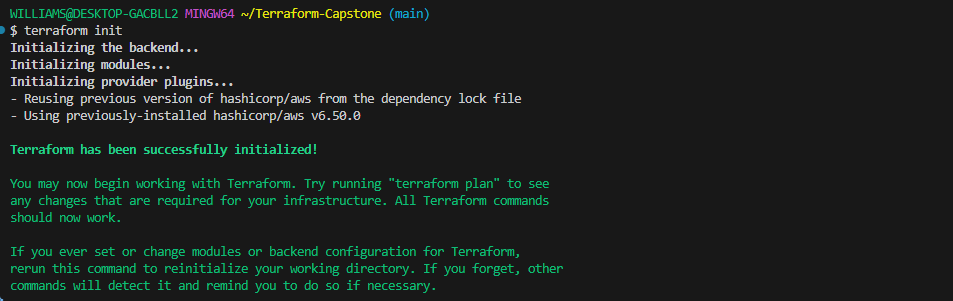

**Validate Configuration**
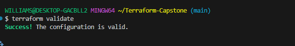


**Preview Infrastructure**

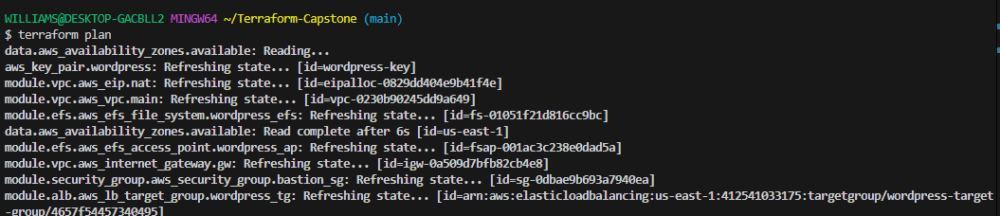

**Create Infrastructure**
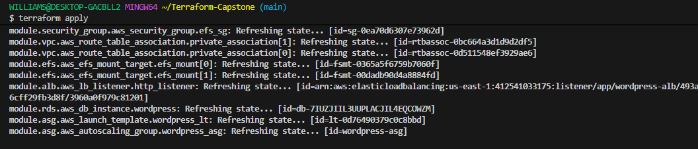

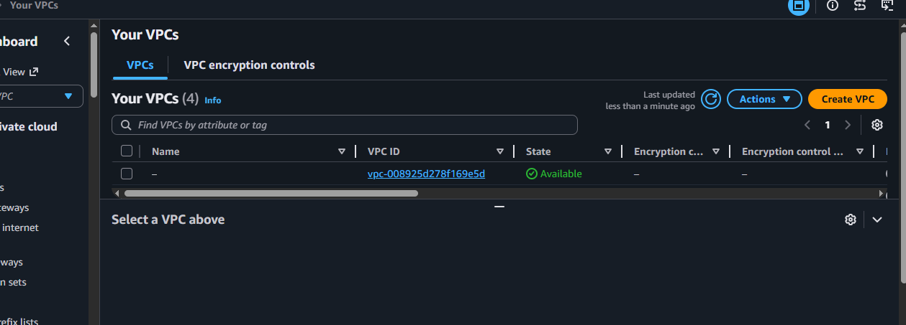

### Create RDS modules
**module/rds/main.tf**
```
resource "aws_db_subnet_group" "rds_subnet_group" {
  name       = "rds-subnet-group"
  subnet_ids = var.private_subnet_ids

  tags = {
    Name = "Wordpress-db-subnet-group"
  }
  
}


resource "aws_db_instance" "wordpress" {

identifier              = "wordpress"
  engine                  = "mysql"
  engine_version          = "8.0"
  instance_class          = var.db_instance_class
  allocated_storage       = var.allocated_storage
  db_name                 = var.db_name
  password                = var.db_password
  username                = var.db_user
  port                    = 3306

  vpc_security_group_ids = var.rds_security_group_ids
    db_subnet_group_name   = aws_db_subnet_group.rds_subnet_group.name


    publicly_accessible    = false
    skip_final_snapshot    = true
    deletion_protection    = false
    multi_az               = false

    tags = {
    Name = "Wordpress-RDS"
    }

}
```
**module/rds/variable.tf**
```
variable "vpc_id" {
  type        = string
  description = "VPC ID"
}

variable "private_subnet_ids" {
  type        = list(string)
  description = "Private subnet IDs for RDS subnet group"
}

variable "wordpress_sg_id" {
  type        = string
  description = "WordPress security group ID"
}

variable "db_name" {
  type        = string
}

variable "db_password" {
  type        = string
  sensitive   = true
}

variable "db_instance_class" {
  description = "RDS instance class"
  type        = string
}

variable "allocated_storage" {
  description = "Storage size for the RDS instance (in GB)"
  type        = number
}

variable "db_user" {
  type = string
}

variable "rds_security_group_ids" {
  type        = list(string)
  description = "List of security group IDs to attach to RDS instance"
  
}
```

**module/rds/output**
```
output "rds_endpoint" {
  value = aws_db_instance.wordpress.endpoint
}

output "db_port" {
  value = aws_db_instance.wordpress.port
}
```

### Create a module for Efs

**module/efs/main.tf**

```
resource "aws_efs_file_system" "wordpress_efs" {
  creation_token = "wordpress-efs"

  tags = {
    Name = "Wordpress-EFS"
  }
}
##EFS MOUNT TARGETS
resource "aws_efs_mount_target" "efs_mount" {
  count = length(var.private_subnet_ids)

  file_system_id  = aws_efs_file_system.wordpress_efs.id
  subnet_id       = var.private_subnet_ids[count.index]
  security_groups = [var.efs_security_group_id]
}

resource "aws_efs_access_point" "wordpress_ap" {
  file_system_id = aws_efs_file_system.wordpress_efs.id
  posix_user {
    uid = 33
    gid = 33
  }
  root_directory {
    path = "/wordpress"
    creation_info {
      owner_gid   = 33
      owner_uid   = 33
      permissions = "755"
    }
  }
  tags = {
    Name = "wordpress-access-point"
  }
}
```
**module/efs/variable.tf**
```
variable "vpc_id" {
  description = "VPC ID"
  type        = string
}

variable "private_subnet_ids" {
  description = "Private subnet IDs for EFS mount targets"
  type        = list(string)
}

variable "efs_security_group_id" {
  description = "Security group ID for EFS mount targets"
  type        = string
}
```

**module/efs/output**
```
output "efs_file_system_id" {
  description = "EFS File System ID"

  value = aws_efs_file_system.wordpress_efs.id
}

output "efs_access_point_id" {
  description = "EFS Access Point ID"

  value = aws_efs_access_point.wordpress_ap.id
}

output "efs_dns_name" {
  description = "EFS DNS Name"

  value = aws_efs_file_system.wordpress_efs.dns_name
}
```
### Create a module for Security-Group
**module/Security-Group**

**module/SG/main.tf**
```
## ALB SECURITY GROUP
resource "aws_security_group" "alb_sg" {
  name        = "alb-security-group"
  description = "Allow HTTP and HTTPS traffic"
  vpc_id      = var.vpc_id

  ingress {
    from_port   = 80
    to_port     = 80
    protocol    = "tcp"
    cidr_blocks = ["0.0.0.0/0"]
  }

  ingress {
    from_port   = 443
    to_port     = 443
    protocol    = "tcp"
    cidr_blocks = ["0.0.0.0/0"]
  }

  egress {
    from_port   = 0
    to_port     = 0
    protocol    = "-1"
    cidr_blocks = ["0.0.0.0/0"]
  }

  tags = {
    Name = "ALB-SG"
  }
}

## WORDPRESS SECURITY GROUP
resource "aws_security_group" "Wordpress_sg" {
  name   = "wordpress-security-group"
  vpc_id = var.vpc_id

  ingress {
    from_port       = 80
    to_port         = 80
    protocol        = "tcp"
    security_groups = [aws_security_group.alb_sg.id]
  }

  ingress {
    from_port       = 22
    to_port         = 22
    protocol        = "tcp"
    security_groups = [aws_security_group.bastion_sg.id]
  }

  egress {
    from_port   = 0
    to_port     = 0
    protocol    = "-1"
    cidr_blocks = ["0.0.0.0/0"]
  }

  tags = {
    Name = "Wordpress-SG"
  }
}

## RDS SECURITY GROUP
resource "aws_security_group" "rds_sg" {
  name   = "rds-security-group"
  vpc_id = var.vpc_id

  ingress {
    from_port       = 3306
    to_port         = 3306
    protocol        = "tcp"
    security_groups = [aws_security_group.Wordpress_sg.id]
  }

  egress {
    from_port   = 0
    to_port     = 0
    protocol    = "-1"
    cidr_blocks = ["0.0.0.0/0"]
  }

  tags = {
    Name = "RDS-SG"
  }
}

## BASTION SECURITY GROUP
resource "aws_security_group" "bastion_sg" {
  name        = "bastion-security-group"
  description = "Allow SSH access from my IP"
  vpc_id      = var.vpc_id

  ingress {
    description = "SSH from my IP"

    from_port   = 22
    to_port     = 22
    protocol    = "tcp"

    cidr_blocks = var.allowed_ssh_cidr
  }

  egress {
    from_port   = 0
    to_port     = 0
    protocol    = "-1"

    cidr_blocks = ["0.0.0.0/0"]
  }

  tags = {
    Name = "Bastion-SG"
  }
}


## EFS SECURITY GROUP
resource "aws_security_group" "efs_sg" {
  name   = "efs-security-group"
  vpc_id = var.vpc_id

  ingress {
    from_port       = 2049
    to_port         = 2049
    protocol        = "tcp"
    security_groups = [aws_security_group.Wordpress_sg.id]
  }

  egress {
    from_port   = 0
    to_port     = 0
    protocol    = "-1"
    cidr_blocks = ["0.0.0.0/0"]
  }

  tags = {
    Name = "EFS-SG"
  }
}
```
**module/SG/variable.tf**
```
variable "vpc_id" {
  type = string
}


  variable "allowed_ssh_cidr" {
  description = "CIDR blocks allowed to SSH into bastion host"
  type        = list(string)
  ##default     = ["0.0.0.0/0"]

}
```
**module/SG/output**
```
output "wordpress_sg_id" {
  value = aws_security_group.Wordpress_sg.id
}

output "rds_sg_id" {
  value = aws_security_group.rds_sg.id
}

output "alb_sg_id" {
  value = aws_security_group.alb_sg.id
}

output "bastion_sg_id" {
  value = aws_security_group.bastion_sg.id
}

output "efs_sg_id" {
  value = aws_security_group.efs_sg.id
}

```

### Create Module for Autoscaling Group
**module/asg/main.tf**
```

resource "aws_launch_template" "wordpress_lt" {
  name_prefix   = "wordpress-launch-"
  image_id      = var.ami_id
  instance_type = var.instance_type
  key_name      = var.key_pair_name
  

  vpc_security_group_ids = var.security_group_ids

  user_data = base64encode(
    templatefile("${path.module}/userdata.sh", {
      efs_id       =  var.efs_id
      access_point =  var.access_point
      rds_endpoint  = var.rds_endpoint
      db_user       = var.db_user
      db_password   = var.db_password
      db_name       = var.db_name

    })
  )
 
  block_device_mappings {
    device_name = "/dev/xvda"
    ebs {
      volume_size = 10
      volume_type = "gp2"
      delete_on_termination = true
    }
  }

  lifecycle {
    create_before_destroy = true
  }

  tags = {
    Name = "wordpress-instance"
  }
}

resource "aws_autoscaling_group" "wordpress_asg" {
  name                      = "wordpress-asg"
  min_size         = var.min_size
  max_size         = var.max_size
  desired_capacity = var.desired_capacity
  vpc_zone_identifier       = var.private_subnet_ids
  health_check_type         = "EC2"
  health_check_grace_period = 300

  launch_template {
    id      = aws_launch_template.wordpress_lt.id
    version = "$Latest"
  }

  target_group_arns = [var.target_group_arn]

  tag {
    key                 = "Name"
    value               = "wordpress-instance"
    propagate_at_launch = true
  }

  lifecycle {
    create_before_destroy = true
  }
}
```
**module/variable.tf**
```
variable "ami_id" {
  type = string
}

variable "instance_type" {
  type = string
}

variable "key_pair_name" {
  type = string
}

variable "security_group_ids" {
  type = list(string)
}

variable "efs_id" {
  type = string
}

variable "access_point" {
  type = string
}

variable "rds_endpoint" {
  type = string

}

variable "db_user" {
  type = string
}

variable "db_password" {
  type = string
  
}

variable "db_name" {
  type = string
}

variable "target_group_arn" {
  type = string
  
}

variable "private_subnet_ids" {
  type = list(string)
  
}

variable "max_size" {
  type = number
  
}

variable "min_size" {
  type = number
}

variable "desired_capacity" {
  type = number
  
}
```

**module/asg/output**
```
output "asg_id" {
  description = "The name of the Auto Scaling Group"
  value       = aws_autoscaling_group.wordpress_asg.id

  
}

output "launch_configuration_id" {
  description = "The ID of the Launch Configuration"
  value       = aws_launch_template.wordpress_lt.id
}

```

Create a user data file inside the asg

**module/asg/user-data.sh**
```
#!/bin/bash
set -euxo pipefail

########################################
# UPDATE SYSTEM
########################################
yum update -y

########################################
# INSTALL DEPENDENCIES
########################################
sudo amazon-linux-extras enable php8.1 -y
sudo yum clean metadata

sudo yum install -y httpd php php-cli php-mysqlnd php-gd php-mbstring php-xml php-fpm unzip curl wget nfs-utils


########################################
# START APACHE
########################################
systemctl enable httpd
systemctl start httpd

########################################
# MOUNT EFS ACCESS POINT
########################################

mkdir -p /var/www/html

echo "Waiting for EFS mount target..."

for i in {1..30}; do
  mount -t efs -o tls,accesspoint=${access_point} ${efs_id}:/ /var/www/html && break
  echo "EFS not ready yet. Retrying..."
  sleep 10
done

########################################
# PERSIST EFS MOUNT
########################################

echo "${efs_id}:/ /var/www/html efs _netdev,tls,accesspoint=${access_point} 0 0" >> /etc/fstab

########################################
# DOWNLOAD WORDPRESS
########################################

cd /tmp

wget https://wordpress.org/latest.tar.gz
tar -xzf latest.tar.gz

########################################
# COPY WORDPRESS FILES
########################################

cp -R wordpress/* /var/www/html/

cd /var/www/html

cp wp-config-sample.php wp-config.php

########################################
# CONFIGURE DATABASE
########################################

sed -i "s/database_name_here/${db_name}/g" wp-config.php
sed -i "s/username_here/${db_user}/g" wp-config.php
sed -i "s/password_here/${db_password}/g" wp-config.php
sed -i "s/localhost/${rds_endpoint}/g" wp-config.php

########################################
# SET PERMISSIONS
########################################

sudo chmod -R 755 /var/www/html
########################################
# HEALTH CHECK FILE
########################################

touch /var/www/html/healthstatus

########################################
# RESTART APACHE
########################################

systemctl restart httpd

echo "WordPress setup completed successfully"
```

### Create a module for ALB
**module/alb/main.tf**
```
resource "aws_lb" "wordpress_alb" {
  name               = "wordpress-alb"
  internal           = false
  load_balancer_type = "application"

  security_groups = [var.alb_sg_id]
  subnets         = var.public_subnet_ids

  tags = {
    Name = "Wordpress-ALB"
  }
}
## TARGET GROUP
resource "aws_lb_target_group" "wordpress_tg" {
  name     = "wordpress-target-group"
  port     = 80
  protocol = "HTTP"

  vpc_id = var.vpc_id

  health_check {
    path = "/"
     interval            = 30
    timeout             = 5
    healthy_threshold   = 3
    unhealthy_threshold = 3
    matcher             = "200-399"
  }
}
## HTTP Listener for ALB
resource "aws_lb_listener" "http_listener" {
  load_balancer_arn = aws_lb.wordpress_alb.arn

  port     = 80
  protocol = "HTTP"

  default_action {
    type             = "forward"
    target_group_arn = aws_lb_target_group.wordpress_tg.arn
  }
}
```

**module/alb/variable.tf**
```
variable "vpc_id" {
  description = "VPC ID"
  type        = string
  
}

variable "public_subnet_ids" {
  description = "Public subnet IDs for ALB"
  type        = list(string)
  
}

variable "alb_sg_id" {
  description = "Security group ID for ALB"
  type        = string
  
}
```

**module/alb/output.tf**
```
output "alb_arn" {
  description = "The ARN of the Application Load Balancer"
  value       = aws_lb.wordpress_alb.arn
  
}

output "alb_dns_name" {
  description = "The DNS name of the Application Load Balancer"
  value       = aws_lb.wordpress_alb.dns_name
  
}

output "target_group_arn" {
    description = "The ARN of the Target Group"
    value       = aws_lb_target_group.wordpress_tg.arn
}
```

### Create a module for Bastion

**module/bastion/main.tf**
```
resource "aws_instance" "bastion" {
  ami                         = var.ami_id
  instance_type               = var.instance_type
  key_name                    = var.ec2_key_name
  subnet_id                   = var.public_subnet_id
  vpc_security_group_ids      = var.security_group_ids
  associate_public_ip_address = true

  tags = {
    Name = "bastion-host"
  }
}

```
**module/bastion/output.tf**
```
output "public_ip" {
  description = "The public IP address of the bastion host"
  value       = aws_instance.bastion.public_ip
  
}
```
**module/bastion/variables.tf**
```

variable "ami_id" {
  type = string
}

variable "instance_type" {
  type = string
}

variable "ec2_key_name" {
  type = string
}

variable "public_subnet_id" {
  type = string
}
variable "security_group_ids" {
  description = "List of security group IDs to attach to the bastion instance"
  type        = list(string)
}
```
Run
```
terraform init
```
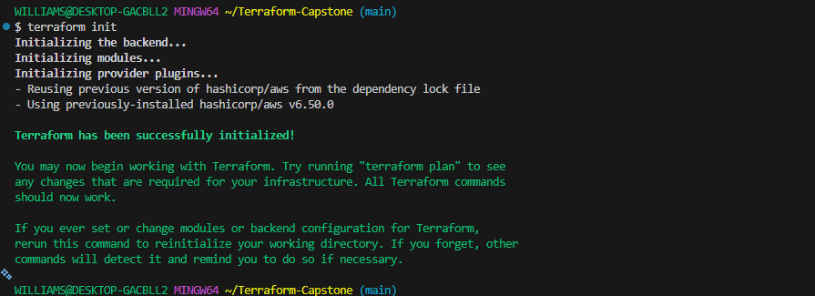

Run
```
terraform plan
```


Run

```
terraform apply
```


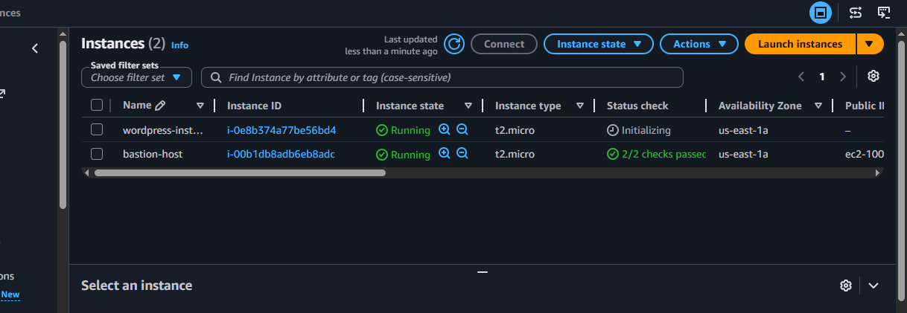


**Autoscaling group**
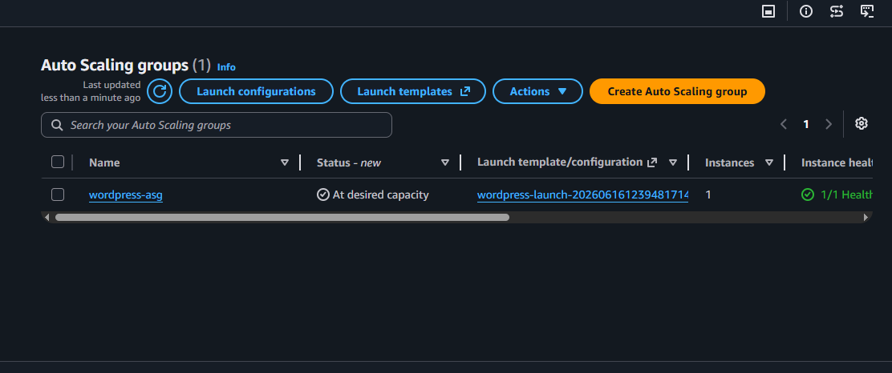

**Security Group**

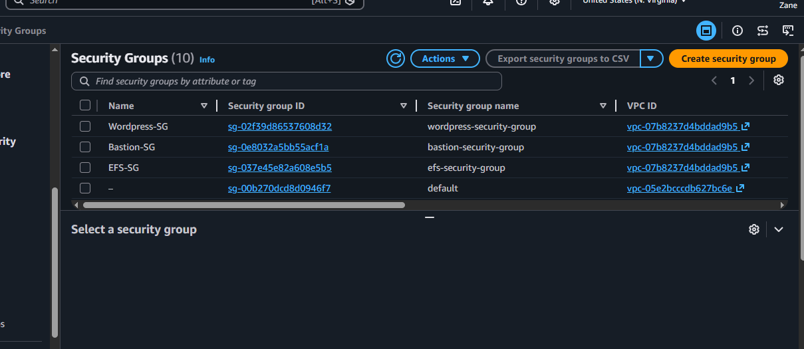

**RDS**
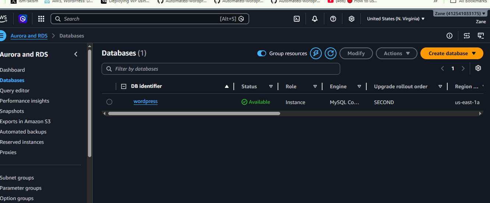

**EFS**
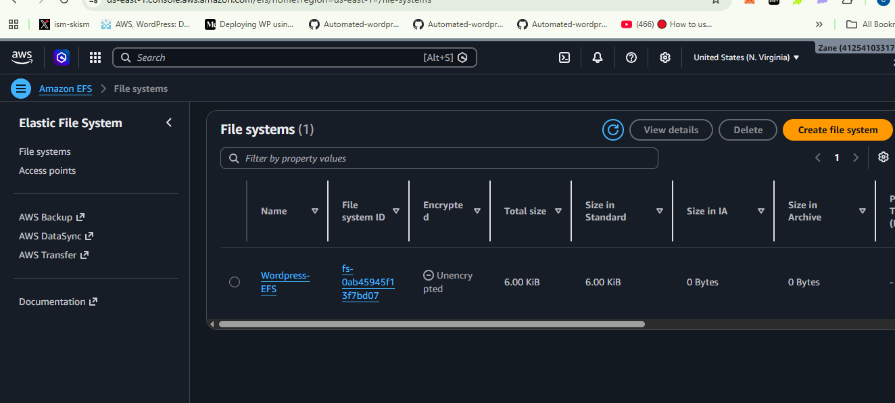

### Ssh into the wordpress via Bastion host

**Start SSH agent on your Windows (Git Bash)**
```
eval $(ssh-agent -s)
```

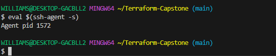

**Add your key to agent**
```
ssh-add ~/Downloads/wordpress-key
```
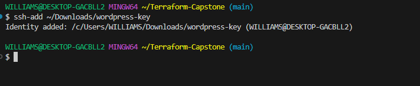


**SSH with agent forwarding**
```
ssh -A ec2-user@100.48.90.98
```
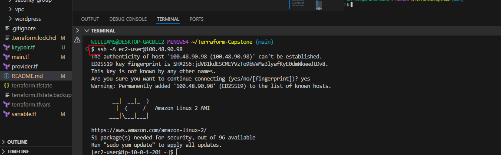

**Inside bastion, try again**

```
ssh ec2-user@10.0.3.201
```

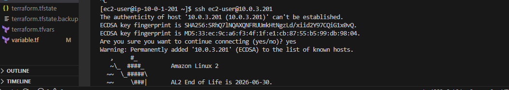

### Test if Apache is installed

Inside your wordpress server
 Run:
 ```
 sudo systemctle status httpd
 ```

 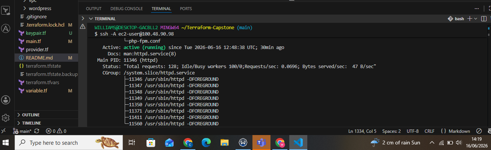

 ```
 sudo systemctl enable httpd
 ```

 ### Check whether WordPress files exist

Run:

```
ls -la /var/www/html
```
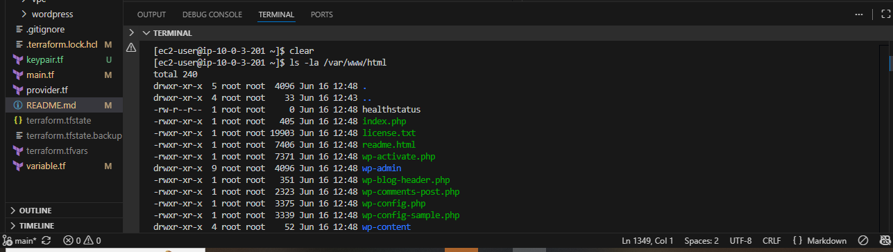


### Check cloud-init logs on this new instance

Run:
```
sudo tail -100 /var/log/cloud-init-output.log
```

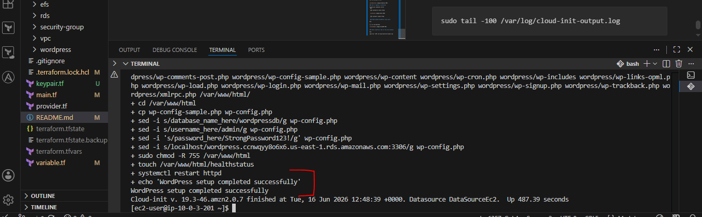

### Check the ALB

```
wordpress-alb-400820561.us-east-1.elb.amazonaws.com
```

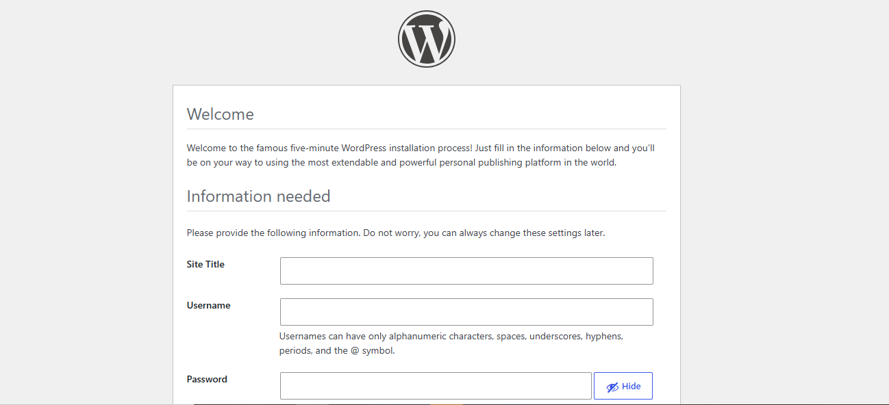


## ERRORS AND FIXES

**EFS Utils Build Failure**
Error:

dpkg: command not found

Occurred while building: amazon-efs-utils

**Cause**
Ubuntu commands were use for Amazon linux

**Fix**
Installation Command was switched to:  
 sudo yum install -y amazon-efs-utils

 ### WordPress Not Downloaded

 **Checking:**

 ls -la /var/www/html

 **Output**
 
 empty directory

 **Cause**
 
 Use data crashed before installation

 **Fix**

 Corrected script redeployed


 ### EFS Permission Problems
 **Error**:
  
  Permisssion not permitted on :
  
  chown -R apache:apache /var/www/html

**Cause**

Files were on Efs

Efs access point already control ownership
Linux could not change ownership


**Fix**

Removed ownership modification.Allow Efs access point permissions to control ownership 

  ### PHP Parse Errors

  **Apache logs**

  PHP Parse error:
unexpected '?'
compat-utf8.php line 47

**Cause**

Amazon Linux 2 default PHP version: php 5.4

Wordpresss latest version require php 7.4+